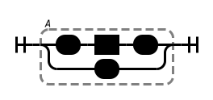
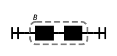
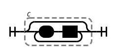

= Rules of Graph Construction

[NOTE]
Wirth uses `terminal` and `NonTerminal`;
the Lemon Parser generator uses the opposite convention.

[NOTE]
ξ is the lowercase Greek letter _Xi_.
It is used to represent segments of a production.

== BNF

== EBNF

== A1 - Recognition Graph

Each non-terminal symbol `A` in a grammar

    A ::= ξ1 | ξ2 | ξ3 .

is mapped into a recognition graph `A` via rules A2 through A6

== A2 - Terminal Symbols

By convention, terminal symbols start with a lower-case letter.

Every occurrence of a _terminal_ symbol in any ξ represents a token obtained from the lexer.
The lexer will recognize the symbol, advance to the next token, and return the token to the caller.

The terminal `x` is represented in the graph by an edge labelled `x` enclosed in an oval:

The terminal `x` is implemented in the diagram code as:

    Terminal('x')

The source code will look like:

[source,go]
read('x')

== A3 - Non-Terminal Symbols

By convention, non-terminal symbols start with an upper-case letter.

Every occurrence of a _non-terminal_ symbol `B` in any ξ corresponds to an invocation of the recognizer `B` in the parser.

The non-terminal `B` is represented in the graph by an edge labelled `B` enclosed in a rectangle:

The non-terminal `B` is implemented in the diagram code as:

    NonTerminal('B')

== A4 - Choice

A production having the form:

    A ::= ξ1 | ξ2 | ξ3 .

is mapped into the graph:

The production is implemented in the diagram code as:

    Choice(1,
        NonTerminal('ξ1'),
        NonTerminal('ξ2'),
        NonTerminal('ξ3'),
    )

Where every ξ is graphed via rules A2 through A6.

[NOTE]
The diagram uses non-terminals to illustrate the graph.
You would use the terminals or non-terminals as appropriate.

== A5 - Sequence

A `ξ` having the form

    ξ = α β γ

is mapped into the graph:

Where `α`, `β`, and `γ` are graphed via rules A2 through A6.

The statement is implemented in the diagram code as:

    NonTerminal('α'),
    NonTerminal('β'),
    NonTerminal('γ'),

[NOTE]
The diagram uses non-terminals to illustrate the graph.
You would use the terminals or non-terminals as appropriate.

== A6 - Zero or More

A `ξ` having the form

    ξ = { α }

is mapped into the graph:

Where `α` is graphed via rules A2 through A6.

The statement is implemented in the diagram code as:

    ZeroOrMore(
        Terminal('α'),
    )

Alternately

    ξ = α .
    ξ = .

== Example 5

The grammar

    A ::= x | (B)
    B ::= A C
    C :: {+ A}

The code for the diagram is

    Group(
        Choice(0,
            Sequence(
                Terminal('('),
                NonTerminal('B'),
                Terminal(')'),
            ),
            Terminal('x')
        ),
        'A'
    )

    Group(
        Sequence(
            NonTerminal('A'),
            NonTerminal('C'),
        ),
        'B'
    )

    Group(
        ZeroOrMore(
            Sequence(
                Terminal('+'),
                NonTerminal('A'),
            ),
        ),
        'C'
    )

== B3 - Sequence of Elements

A _sequence_ of elements `ξ = α β γ`:

is mapped into the compound statement:

[source,go]
{
    T(α)
    T(β)
    T(γ)
}

== B3 = Choice of Elements

A _choice_ of elements `A ::= ξ1 | ξ2 | ξ3`

is mapped into an _if_ or _switch_ statment:

[source,go]
l1, l2, l3 := first(ξ1), first(ξ2), first(ξ3)
if l1.Contains(ch) {
    T(ξ1)
} else if l2.Contains(ch) {
    T(ξ2)
} else if l3.Contains(ch) {
    T(ξ3)
} else {
    error()
}

[source,go]
l1, l2, l3 := first(ξ1), first(ξ2), first(ξ3)
switch {
case l1.Contains(ch):
    T(ξ1)
case l2.Contains(ch):
    T(ξ2)
case l3.Contains(ch):
    T(ξ3)
default:
    error()
}

Where L~i~ denotes the set of initial symbols of the set of elements (`first(ξ1 | ξ2 | ξ3)`).

== B5 - Loop

A _loop_ of the form `ξ = { α }`

[source,go]
l := first(ξ)
for l.Contains(ch) {
    T(ξ)
}

Where L denotes the set of initial symbols of the element `ξ` (`first(ξ)`).

== B6 - Non-Terminal

An element of a graph representing the _non-terminal_ `B`

Is implemented as a call to the procedure `B`.

[source,go]
B()

== B7 - Terminal

An element of a graph representing the _terminal_ `x`

Is implemented as an _if_ statement:

[source,go]
if ch == x {
    read(ch)
} else {
    error()
}

== EBNF

=== Terminals

A _terminal_ `x` in a grammar is implemented as

[source,go]
if token.Type == x {
    token = lexer.Read()
} else {
    error()
}

=== Non-Terminals

A _non-terminal_ `B` in a grammar is implemented as

[source,go]
B(lexer)

== Sequence of Elements

A _sequence_ of elements `B C D` in a grammar is implemented as

[source,go]
B(lexer)
C(lexer)
D(lexer)

== Choice of Elements

A _choice_ of elements `B | C | D` in a grammar is implemented as

[source,go]
if first(B).Contains(token) {
    B(lexer)
} else if first(C).Contains(token) {
    C(lexer)
} else if l3.Contains(token) {
    D(lexer)
} else {
    error()
}

== Optional Loop of Elements

An _optional_ loop (zero or more) elements of `{ α }` in a grammar is implemented as

[source,go]
for set := first(α); set.Contains(ch); {
    α()
}

